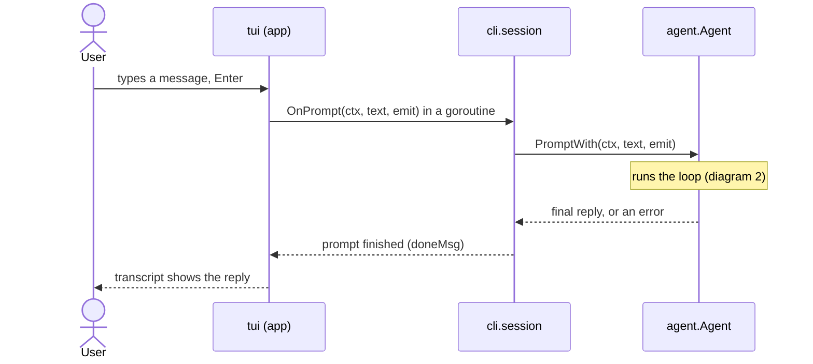
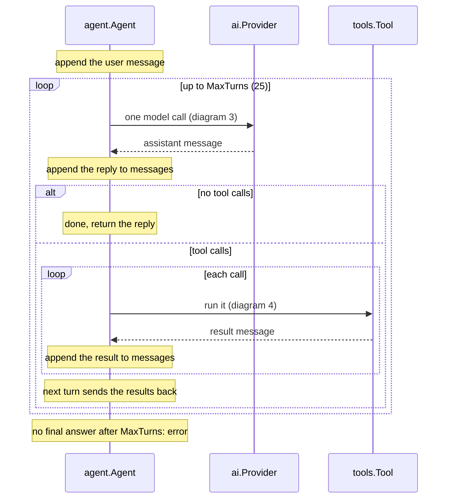
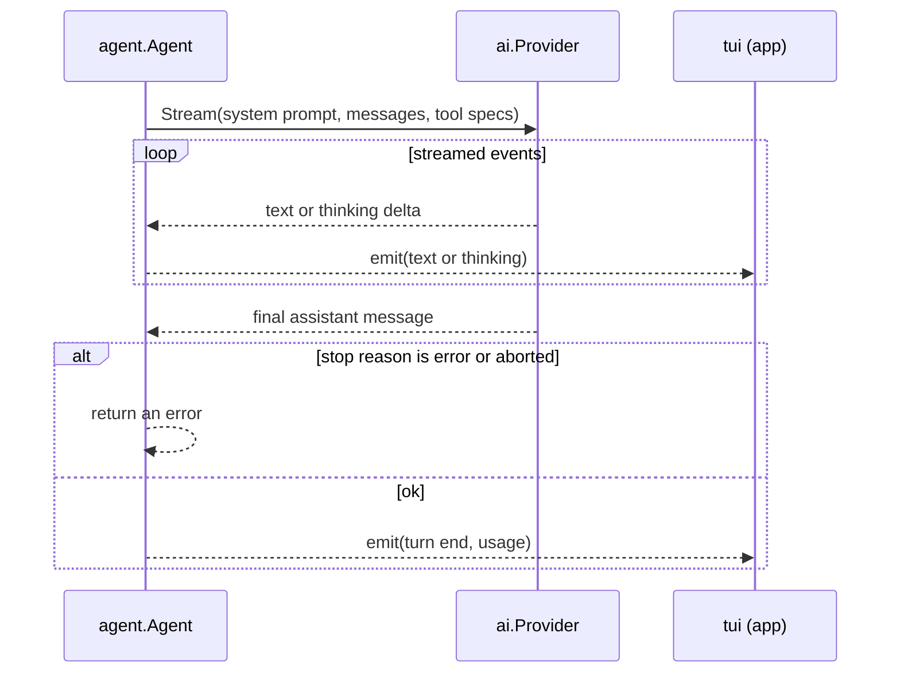
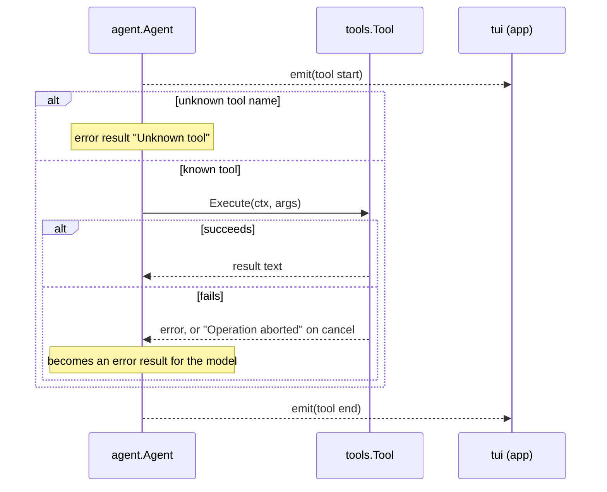

# pi-go

A Go clone of [PI](https://github.com/earendil-works/pi): a terminal coding agent built as a learning project for harness engineering. It streams model output, lets the model inspect and modify the working directory with tools, and keeps an interactive conversation alive in a full-screen terminal UI.

> **Project status:** the core agent loop, TUI, Ollama support, OpenAI Codex support, authentication, and the `read`, `bash`, `edit`, and `write` tools are implemented. Sessions on disk, compaction, MCP, extensions, JSON/RPC modes, and several PI command-surface features are not yet implemented. See [CHECKLIST.md](CHECKLIST.md) for the roadmap.

## Features

- Interactive Bubble Tea terminal UI with streamed text, reasoning, tool activity, transcript scrolling, mouse selection, and `@` file tags.
- One-shot / pipeline-friendly mode for scripts and CI.
- Model adapters for local **Ollama** (OpenAI-compatible completions API) and **OpenAI Codex** (ChatGPT OAuth / Responses API).
- Persistent model selection through the `/model` command.
- Provider login and readiness checks.
- A bounded, recoverable agent loop: tool failures return to the model; failed prompts do not leave partial conversation history behind.
- Built-in filesystem and shell tools rooted at the directory where `pi-go` starts.

## Requirements

- Go **1.27.1** or newer (see [go.mod](go.mod)).
- A terminal for interactive mode.
- One usable model provider:
  - [Ollama](https://ollama.com/) running locally, with a coding model pulled; or
  - an OpenAI Codex / ChatGPT Plus or Pro login.

## Install and run

Build from a checkout:

```bash
git clone <repository-url>
cd pi-go
go build -o pi-go ./cmd/pi-go
./pi-go
```

Or install it into your Go bin directory:

```bash
go install ./cmd/pi-go
pi-go
```

Run the test suite with:

```bash
go test ./...
```

### Quick start with Ollama

The default model is `ollama/qwen2.5-coder:7b`. Install and start Ollama, then pull that model (or select another installed model with `/model`):

```bash
ollama pull qwen2.5-coder:7b
ollama serve # only needed when Ollama is not already running
pi-go "Explain this repository"
```

Check that pi-go can reach Ollama:

```bash
pi-go auth check --provider ollama
```

### Quick start with OpenAI Codex

Log in through the browser-based OAuth flow, then select a Codex model:

```bash
pi-go auth login --provider openai-codex
pi-go --model openai-codex/<model-id> "Help me fix this test"
```

The login command prints a URL and accepts the redirect URL if the local callback cannot be reached.

## Usage

```text
pi-go [messages...]
```

With a terminal attached, `pi-go` opens an interactive session. Positional arguments become the first prompt:

```bash
pi-go "Review the current working tree"
```

Use `-p` / `--print` to answer once and print the final response instead of opening the UI:

```bash
pi-go -p "Summarize README.md"
```

When stdin or stdout is not a terminal, pi-go automatically uses one-shot mode. Piped input is placed before command-line text:

```bash
git diff | pi-go -p "Review this diff and list risks"
```

Useful root flags:

| Flag | Description |
| --- | --- |
| `-p`, `--print` | Run once and print the answer. |
| `--model <provider/id>` | Choose a model. A bare model ID is allowed only when it can be resolved from `models.json`. |
| `--provider <provider>` | Choose the provider independently of the model ID. |
| `--version` | Print the build version. |

Run `pi-go --help` for the current command reference.

### Interactive commands

In the session, ordinary input is sent to the agent. Slash commands provide UI actions and expose supported Cobra subcommands. Built-ins include `/help`, `/clear`, `/quit`, and `/model`; `/model` opens a picker, while `/model provider/id` switches directly. Slash commands run against a fresh command tree and their output is added to the transcript.

The current conversation is kept only for the lifetime of the process. Starting pi-go again starts a new conversation.

## Authentication and configuration

Supported credential providers are `ollama`, `openai`, and `openai-codex`. `ollama` works without a real API key but its local server must be reachable. `openai-codex` uses OAuth; the other currently supported login methods accept API keys.

```bash
# Choose a provider interactively, or specify one explicitly.
pi-go auth login
pi-go auth login --provider openai
pi-go auth login --provider openai-codex

# Inspect provider readiness.
pi-go auth check
pi-go auth check --provider ollama
pi-go auth check --json
```

Runtime model adapters are currently available for `ollama` and `openai-codex`. The `openai` credential entry is available for authentication/configuration work but does not yet have a model adapter.

By default, pi-go stores its files under `~/.pi-go/agent`:

| File | Purpose |
| --- | --- |
| `auth.json` | API keys or OAuth tokens; written owner-readable only. |
| `models.json` | Optional provider base URLs, credentials, and model catalog entries. |
| `settings.toml` | User choices, currently including the default model. |
| `config.toml` | Hand-written module configuration. |

Set `PI_GO_CODING_AGENT_DIR` to use another directory, which is also useful for isolated testing:

```bash
export PI_GO_CODING_AGENT_DIR="$PWD/.pi-go-agent"
```

Configuration values use this precedence: command-line flags, environment variables, `config.toml`, then built-in defaults. For example, keys in an `[auth]` table can be overridden with `PI_GO_AUTH_<KEY>` environment variables.

## Tools and safety model

The agent receives four tools, all rooted at the process working directory:

| Tool | What it does |
| --- | --- |
| `read` | Reads text files, with line/byte limits and pagination. |
| `bash` | Runs a shell command in the working directory; captures combined output and supports an optional timeout. |
| `edit` | Applies one or more exact, unique, non-overlapping text replacements to a file. |
| `write` | Creates or fully overwrites a file, creating parent directories as needed. |

Tool output is bounded to protect the model context. Large `read` output can be continued with an offset; truncated `bash` output is saved to a temporary file when possible. Tools do not implement a sandbox or confirmation layer: use pi-go only in directories where you are comfortable allowing the selected model to read files and execute commands.

## How the agent loop works

When you send a message, the agent calls the model, runs any tools the model asks for, sends the results back, and repeats until the model answers without asking for a tool. The loop lives in [internal/agent/agent.go](internal/agent/agent.go). The diagrams below split it into four parts.

### 1. From keypress to the agent



### 2. The loop: one turn at a time



### 3. One model call



### 4. One tool call



### Failure behavior

- A tool failure or an unknown tool name goes back to the model as an error result. The model can react to it, and the loop continues.
- A model error, a cancel (Esc), or reaching the 25-turn limit ends the prompt with an error. The conversation is then cut back to before your message, so a failed prompt leaves no half-finished turns.

## Project layout

```text
cmd/pi-go/          executable entry point
internal/agent/     conversation loop, events, and system prompt
internal/ai/        model/provider types, streaming, Ollama and Codex adapters
internal/auth/      provider credentials, OAuth, model catalog, readiness checks
internal/cli/       Cobra root command, modes, model/session wiring
internal/commands/  implemented command adapters (`auth`)
internal/config/    TOML configuration loading and validation
internal/settings/  persistent user settings
internal/tools/     built-in read, bash, edit, and write tools
internal/tui/       Bubble Tea interactive interface
```

For design notes and planned command-surface structure, see [docs/structure.md](docs/structure.md).