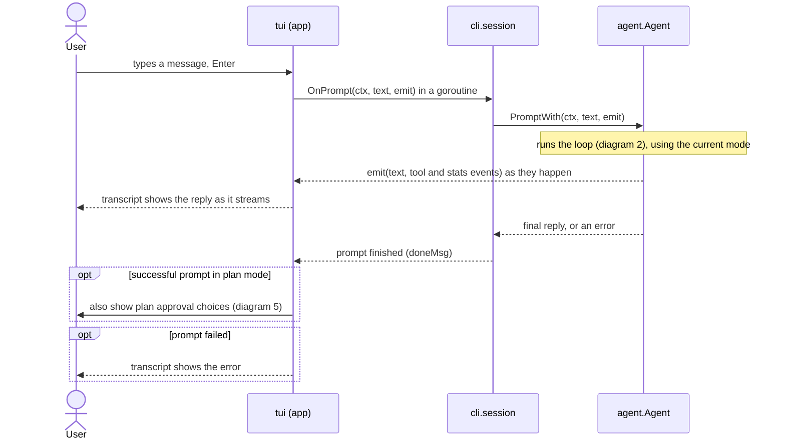
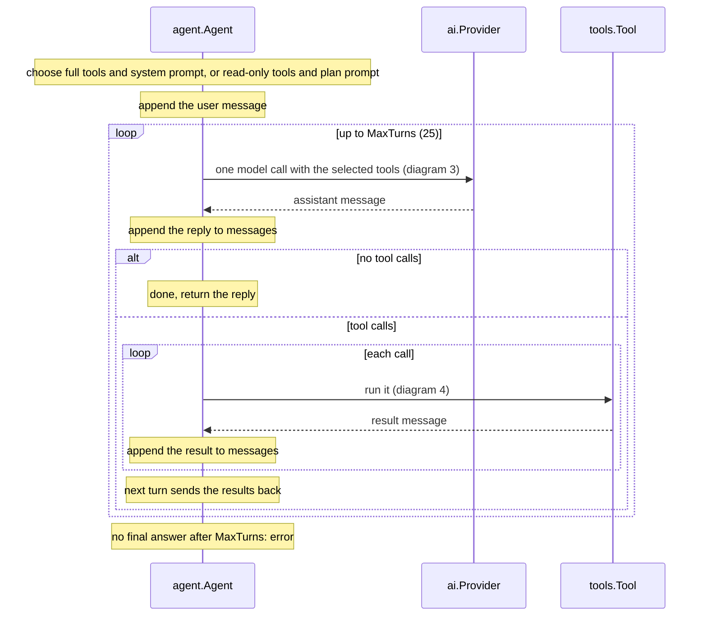
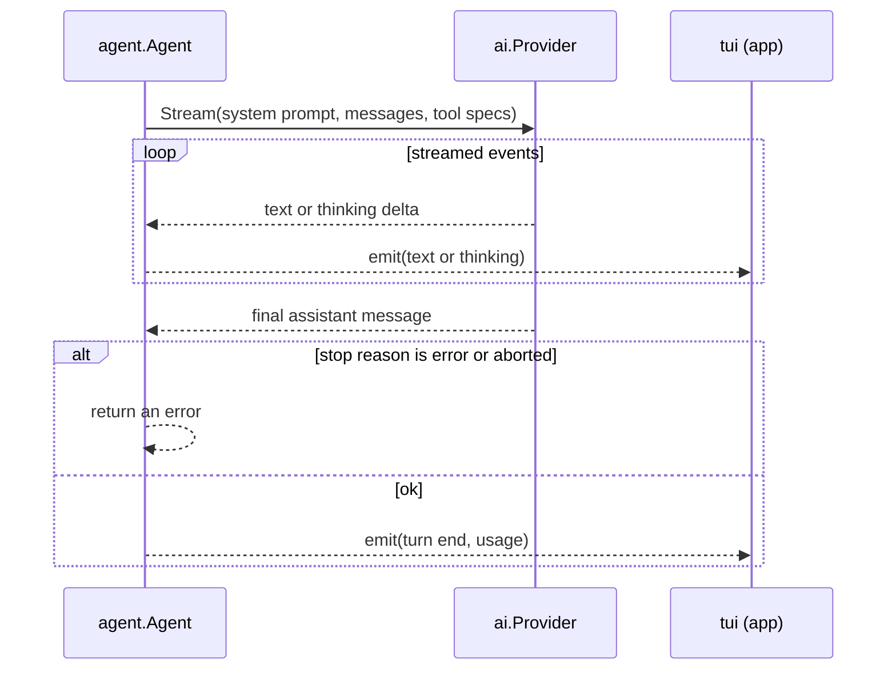
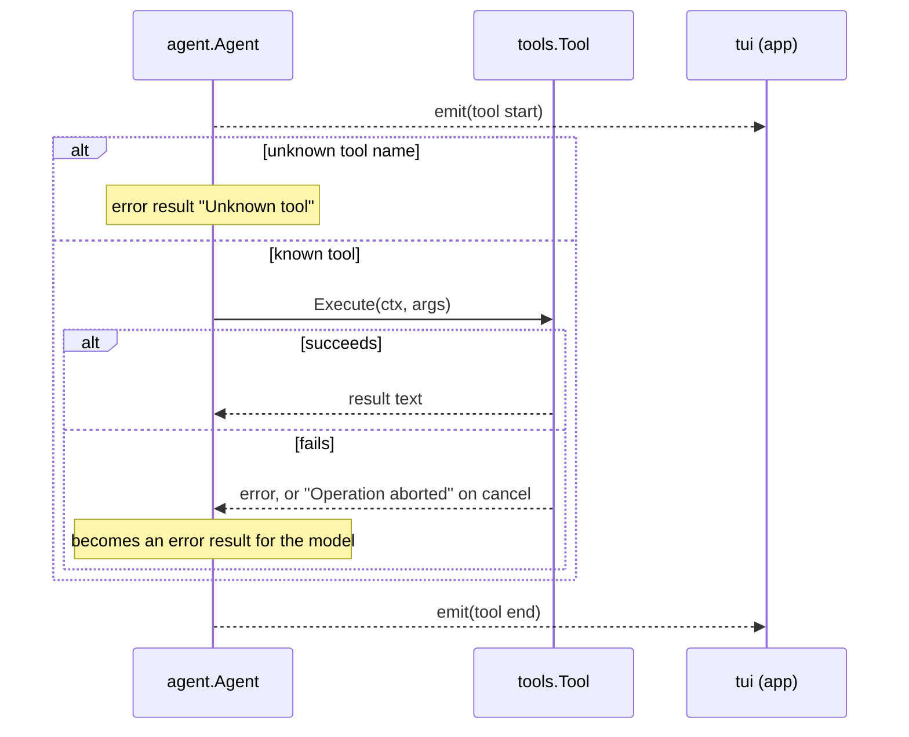
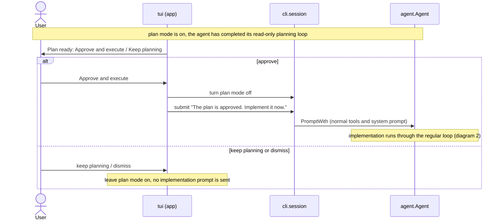

# pi-go

A Go clone of [PI](https://github.com/earendil-works/pi): a terminal coding agent built as a learning project for harness engineering. It streams model output, lets the model inspect and modify the working directory with tools, and keeps an interactive conversation alive in a full-screen terminal UI.

> **Project status:** the core agent loop, TUI, Ollama support, OpenAI Codex support, authentication, and the `read`, `bash`, `edit`, and `write` tools are implemented. Sessions on disk, compaction, MCP, extensions, JSON/RPC modes, and several PI command-surface features are not yet implemented. See [CHECKLIST.md](CHECKLIST.md) for the roadmap.

## Features

- Interactive Bubble Tea terminal UI with streamed text, reasoning, tool activity, transcript scrolling, mouse selection, and `@` file tags.
- One-shot / pipeline-friendly mode for scripts and CI.
- Model adapters for local **Ollama** (OpenAI-compatible completions API) and **OpenAI Codex** (ChatGPT OAuth / Responses API).
- Persistent model selection through the `/model` command.
- Auto routing: `/model auto` and `/effort auto` pick the model and reasoning effort for each prompt, rated by a local [Laya](https://huggingface.co/convaiinnovations/laya) classifier or by heuristics.
- Provider login and readiness checks.
- A bounded, recoverable agent loop: tool failures return to the model; failed prompts do not leave partial conversation history behind.
- Built-in filesystem and shell tools rooted at the directory where `pi-go` starts.

## Requirements

- Go **1.27.1** or newer (see [go.mod](go.mod)).
- A terminal for interactive mode.
- One usable model provider:
  - [Ollama](https://ollama.com/) running locally, with a coding model pulled; or
  - an OpenAI Codex / ChatGPT Plus or Pro login.

## Install and run

Build from a checkout:

```bash
git clone <repository-url>
cd pi-go
go build -o pi-go ./cmd/pi-go
./pi-go
```

Or install the latest release straight from GitHub (needs Go 1.27+):

```bash
go install github.com/phucvinh57/pi-go/cmd/pi-go@latest
pi-go
```

Pin a version with `@v1.2.3` instead of `@latest`. `go install` puts the binary in `$(go env GOBIN)`, or `$(go env GOPATH)/bin` (usually `~/go/bin`) when `GOBIN` is unset; make sure that directory is on your `PATH`. From a checkout, `go install ./cmd/pi-go` does the same.

Run the test suite with:

```bash
go test ./...
```

### Quick start with Ollama

The default model is `ollama/qwen2.5-coder:7b`. Install and start Ollama, then pull that model (or select another installed model with `/model`):

```bash
ollama pull qwen2.5-coder:7b
ollama serve # only needed when Ollama is not already running
pi-go "Explain this repository"
```

Check that pi-go can reach Ollama:

```bash
pi-go auth check --provider ollama
```

### Quick start with OpenAI Codex

Log in through the browser-based OAuth flow, then select a Codex model:

```bash
pi-go auth login --provider openai-codex
pi-go --model openai-codex/<model-id> "Help me fix this test"
```

The login command prints a URL and accepts the redirect URL if the local callback cannot be reached.

## Usage

```text
pi-go [messages...]
```

With a terminal attached, `pi-go` opens an interactive session. Positional arguments become the first prompt:

```bash
pi-go "Review the current working tree"
```

Use `-p` / `--print` to answer once and print the final response instead of opening the UI:

```bash
pi-go -p "Summarize README.md"
```

When stdin or stdout is not a terminal, pi-go automatically uses one-shot mode. Piped input is placed before command-line text:

```bash
git diff | pi-go -p "Review this diff and list risks"
```

Useful root flags:

| Flag | Description |
| --- | --- |
| `-p`, `--print` | Run once and print the answer. |
| `--model <provider/id>` | Choose a model. A bare model ID is allowed only when it can be resolved from `models.json`. |
| `--provider <provider>` | Choose the provider independently of the model ID. |
| `--version` | Print the build version. |

Run `pi-go --help` for the current command reference.

### Interactive commands

In the session, ordinary input is sent to the agent. Slash commands provide UI actions and expose supported Cobra subcommands. Built-ins include `/help`, `/clear`, `/quit`, `/model`, and `/effort`; `/model` opens a picker, while `/model provider/id` (or `/model auto`) switches directly. Slash commands run against a fresh command tree and their output is added to the transcript.

The current conversation is kept only for the lifetime of the process. Starting pi-go again starts a new conversation.

## Authentication and configuration

Supported credential providers are `ollama`, `openai`, `openai-codex`, and `laya`. `ollama` and `laya` work without a real API key, but their local servers must be reachable. `openai-codex` uses OAuth; the other currently supported login methods accept API keys. `laya` is the classifier used by [auto routing](#auto-routing), not a chat model; it needs a key (`LAYA_API_KEY`) only when `laya-serve` was started with one. It is optional, so the login pickers and `pi-go auth check` without `--provider` leave it out; reach it with `--provider laya`.

```bash
# Choose a provider interactively, or specify one explicitly.
pi-go auth login
pi-go auth login --provider openai
pi-go auth login --provider openai-codex

# Remove a saved credential from auth.json (env vars and models.json are untouched).
pi-go auth logout
pi-go auth logout --provider openai

# Inspect provider readiness.
pi-go auth check
pi-go auth check --provider ollama
pi-go auth check --json
```

Runtime model adapters are currently available for `ollama` and `openai-codex`. The `openai` credential entry is available for authentication/configuration work but does not yet have a model adapter.

In the interactive session, `/effort` offers `auto`, `low`, `medium`, `high`, `xhigh`, and `max`. The choice survives `/model`; before choosing, the model uses its own default. Codex maps `low` to `light` and `max` to `ultra`; Claude uses `low` through `max` directly (Claude has no runtime adapter yet). OpenAI-compatible providers with no higher-effort vocabulary fall back to `high` for `xhigh` and `max`.

By default, pi-go stores its files under `~/.pi-go/agent`:

| File | Purpose |
| --- | --- |
| `auth.json` | API keys or OAuth tokens; written owner-readable only. |
| `models.json` | Optional provider base URLs, credentials, and model catalog entries. |
| `settings.toml` | User choices, currently the default model, and the `[auto]` routing table. |
| `config.toml` | Hand-written module configuration. |

Set `PI_GO_CODING_AGENT_DIR` to use another directory, which is also useful for isolated testing:

```bash
export PI_GO_CODING_AGENT_DIR="$PWD/.pi-go-agent"
```

Configuration values use this precedence: command-line flags, environment variables, `config.toml`, then built-in defaults. For example, keys in an `[auth]` table can be overridden with `PI_GO_AUTH_<KEY>` environment variables.

## Auto routing

`auto` is a model and an effort level that are decided again for each prompt, like PI's `jev/auto` virtual model, but rated on your machine: by heuristics, or by a local classifier once you turn it on. Select it with `/model auto` or `--model auto` (save it with `/model --default auto`), and `/effort auto`. Either can be auto on its own: an auto effort with a fixed model only changes the reasoning level.

Before the first model call of a prompt, the router rates the prompt:

1. **Laya** (`laya/english`), when `settings.toml` names it (`[auto] classifier = "laya/english"`; it is off by default, because each prompt is then sent to whatever listens on its address). It is a classifier that answers typed questions in one forward pass, served by `laya-serve` on `http://127.0.0.1:8000`. It speaks the System One protocol of TypeSafe's Jev, which PI's routers use. It answers two questions in about 75 ms on a GPU: what kind of work it is (plan, implement, debug, refactor, review, explain, chat) and how demanding it is (trivial → architectural). It reads only the prompt and the previous reply (cut to 1,000 characters), so that "go ahead with that plan" is rated by the plan; tagged `@` files are reduced to their names. Nothing leaves the machine.
2. Without a classifier, or when `laya-serve` is not running or does not answer within 3.5 s, **heuristics** decide from the prompt's length and wording, tagged files, plan mode, and conversation size. Notices then end in `· heuristic`, with the reason when the classifier failed.

To run Laya (Python 3.10+; PyTorch uses the GPU when there is one):

```bash
python3 -m venv .venv
.venv/bin/pip install "laya[serve]"
LAYA_HOST=127.0.0.1 LAYA_MODELS=english LAYA_PRELOAD=1 .venv/bin/laya-serve   # downloads the checkpoint on first start
pi-go auth check --provider laya                                                 # ready once the server is up
```

The rating becomes a demand from 0 to 3, then a model and an effort. Trivial work goes to the weakest model, architectural work to the strongest, and the rest in between. Effort goes from `low` to `xhigh` (auto never picks `max`), and only to models that can reason: Codex models, models with `"reasoning": true` in `models.json`, and Ollama models whose server lists the `thinking` capability. Others get no effort, as a model that cannot reason may reject one. Plans and reviews never go to the weakest model. Switching loses the prompt cache, so a model that is close enough is kept, and so is any model when the rating is unsure. Short follow-ups such as "ok, go on" stay where they are. The choice holds for the whole prompt, tool calls included. A notice such as `auto: openai-codex/gpt-5.6-sol · effort high (debug, demanding)` shows where each prompt went.

The candidates are every model `/model` lists, ordered from weakest to strongest by what is known: local Ollama models first, then unpriced remote models, then priced models from cheapest to dearest, then subscription models. Models alike in all that are ordered by the size in their ID (`1b` before `70b`), then by version within a family (`gpt-5.5` before `gpt-6-sol`); anything still tied, such as sibling Codex models, keeps name order, so list them in `[auto] models` to be sure. Models whose known context window is too small for the conversation are skipped, and so are the models of a provider that could not be listed (its server is likely down), with a warning. The list is kept for five minutes, or 30 seconds after a provider failed, and `/model` lists again. To choose the ladder yourself, or to tune the router, add an `[auto]` table to `settings.toml`:

```toml
default_model = "auto"

[auto]
# Only these models, weakest first. Omit to use every logged-in model. A model
# its provider does not list (such as openai-codex/gpt-5.3-codex-spark) may be named.
models = ["ollama/qwen2.5-coder:7b", "openai-codex/gpt-5.6-luna", "openai-codex/gpt-5.6-sol"]
classifier = "laya/english"          # or "laya/multilingual"; omit, or "none", for the heuristics only
timeout_ms = 3500                    # how long to wait for the classifier
min_prompt_chars = 12                # shorter prompts keep the model in use
```

## Tools and safety model

The agent receives four tools, all rooted at the process working directory:

| Tool | What it does |
| --- | --- |
| `read` | Reads text files, with line/byte limits and pagination. |
| `bash` | Runs a shell command in the working directory; captures combined output and supports an optional timeout. |
| `edit` | Applies one or more exact, unique, non-overlapping text replacements to a file. |
| `write` | Creates or fully overwrites a file, creating parent directories as needed. |

Tool output is bounded to protect the model context. Large `read` output can be continued with an offset; truncated `bash` output is saved to a temporary file when possible. Tools do not implement a sandbox or confirmation layer: use pi-go only in directories where you are comfortable allowing the selected model to read files and execute commands.

## How the agent loop works

When you send a message, the agent calls the model, runs any tools the model asks for, sends the results back, and repeats until the model answers without asking for a tool. In plan mode, the agent instead offers only read-only tools and asks for a proposed plan; after the response, the TUI lets you approve execution or keep planning. The loop lives in [internal/agent/agent.go](internal/agent/agent.go), with plan approval handled by the TUI. The diagrams below show the prompt flow.

### 1. From keypress to the agent



### 2. The loop: one turn at a time



### 3. One model call



### 4. One tool call



### 5. Plan approval in the TUI

Plan mode can be toggled with **Shift+Tab** or `/plan` (also `/plan on` and `/plan off`). While it is on, the agent uses a plan-specific system prompt and exposes only read-only tools; it asks the model to return a concrete plan without making changes. A successful plan response opens a picker:



Approval submits a new prompt; it does not resume the planning turn. Keeping or dismissing the picker leaves plan mode on. Plan mode is a TUI feature; one-shot mode does not show the approval picker.

### Failure behavior

- A tool failure or an unknown tool name goes back to the model as an error result. The model can react to it, and the loop continues. Plan mode offers only read-only tools, and any attempted unavailable tool is returned as an error result rather than executed.
- A model error, a cancel (Esc), or reaching the 25-turn limit ends the prompt with an error. The conversation is then cut back to before your message, so a failed prompt leaves no half-finished turns. Failed plan prompts do not open the approval picker.

## Project layout

```text
cmd/pi-go/          executable entry point
internal/agent/     conversation loop, events, and system prompt
internal/ai/        model/provider types, streaming, Ollama and Codex adapters
internal/auth/      provider credentials, OAuth, model catalog, readiness checks
internal/cli/       Cobra root command, modes, model/session wiring
internal/commands/  implemented command adapters (`auth`)
internal/route/     auto routing: rate a prompt, pick its model and effort
internal/config/    TOML configuration loading and validation
internal/settings/  persistent user settings
internal/tools/     built-in read, bash, edit, and write tools
internal/tui/       Bubble Tea interactive interface
```

For design notes and planned command-surface structure, see [docs/structure.md](docs/structure.md).